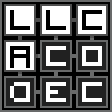
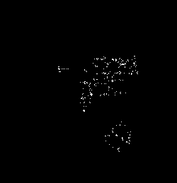
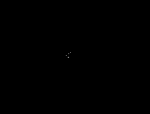
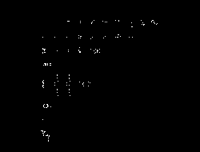
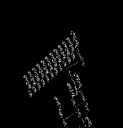

# llcacodec



**L**ife-**L**ike **C**ellular **A**utomata **Codec**

Decoding and Encoding of Life-Like Cellular Automata Data Files  
For easy decoding and encoding of Game-Of-Life patterns in Cellular Automata applications

```npm install --save-exact llcacodec```

> **NOTE**: llcacodec is currently in pre-release testing, which means that there may be many unaccounted bugs and
> unpredicted behaviors present, as well as that the API is subject to change at any time.
> **It is currently recommended to install the package using --save-exact with npm.**

[DOCUMENTATION.md: Documentation, Quickstart, and Supported File and Rule Formats](DOCUMENTATION.md)  
[DEV_DOCUMENTATION.md: Developer Documentation, **Pattern Downloads**, and Further Reading](DEV_DOCUMENTATION.md)

---

Some examples of patterns loaded by llcacodec





